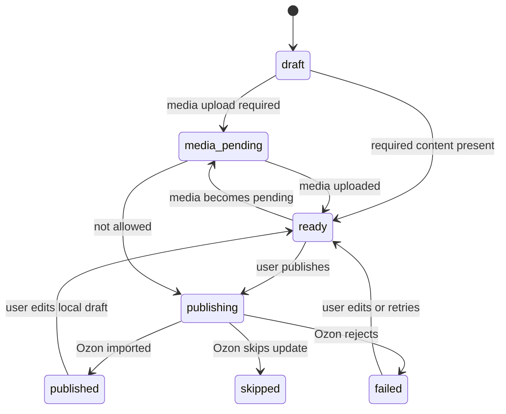
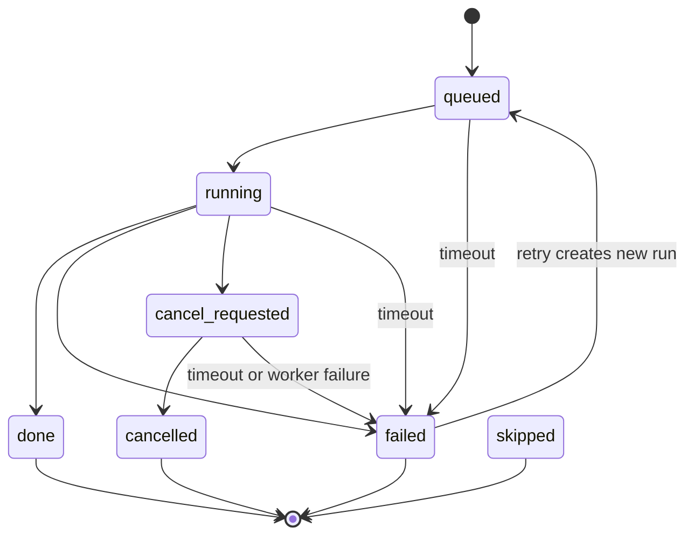
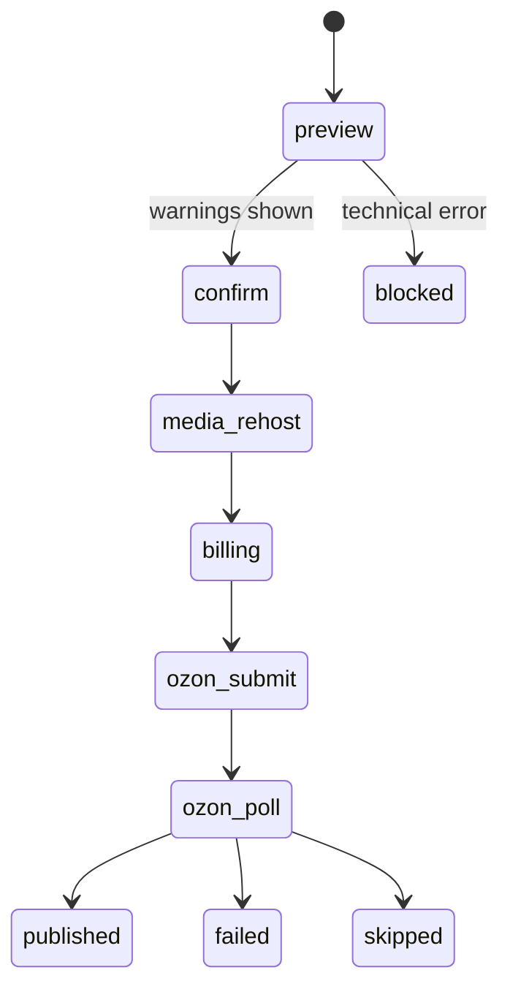

# State Machines

## Draft

Draft validation risks do not block publish. They are shown as warnings with `field`, `step`, and `fix_action`. Technical prerequisites still block execution when the system cannot submit a payload, for example media still uploading, missing RUB rate for RUB contracts, missing OSS fallback, billing failure, or payload construction failure.

## Task Run

`task_runs` is the unified task index. Draft-scoped tasks use `draft_id`; global sync tasks may use `draft_id = null`.

Covered task types include:

- `ai_text`
- `ai_image`
- `media_rehost`
- `category_recognition`
- `attribute_mapping`
- `attribute_ai_fill`
- `translate`
- `rich_content`
- `publish`
- `warehouse_sync`
- `fbs_pull`
- `ozon_product_pull`

Active tasks are `queued`, `running`, `submitted`, `designing`, and `cancel_requested`. Pipeline retry returns the active task instead of submitting a duplicate. Stale active tasks are marked `failed` with a timeout error when Pipeline state is loaded.

## Publish

Preflight warnings are advisory. The user can continue after confirmation. Technical errors stop before `ozon_submit`.

## Pipeline

Pipeline step states:

- `pending`
- `running`
- `warning`
- `blocked`
- `failed`
- `done`
- `skipped`
- `cancelled`

`warning` means the user can continue. `blocked` means the system cannot execute the next operation yet. The Workbench uses `pipeline.next` to offer the next runnable or retryable action.
